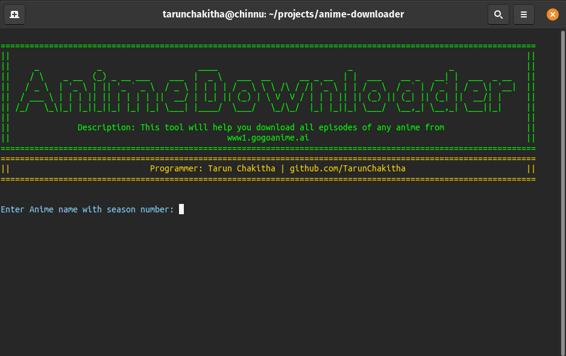

# Anime Downloader (Python 3+)
Anime Downloader will help you download any anime from www1.gogoanime.ai with ease.

### Screenshots

##### Coded in Python 3.8.5 (www.python.org)


<!--  -->

##### Entering the details:


##### Search for episodes:


##### Downloading episodes in HD:


##### Epiodes saved to local folder:


## Setup

```
pip3 install -r requirements.txt
python3 downloader.py
```

## Instructions to use the script:

Medium blog: https://saitarun-uppari.medium.com/python-script-to-automatically-download-all-the-episodes-of-any-anime-from-gogoanime-2ff05af859b5

### Credits

**Developer:** [Tarun Chakitha](https://www.linkedin.com/in/tarunchakitha/) 
**License:** MIT


